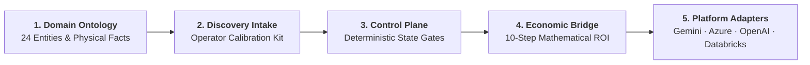

# Hi, I'm [Your Name] — Forward Deployed Engineer (FDE)

> **Forward Deployed Engineer (FDE)** operating at the intersection of **Enterprise Domain Ontologies**, **Deterministic Control Planes**, and **Mathematical Economic ROI Translation**.  
> Specializing in modeling high-friction real-world operations (fluvial river logistics, customs corridors, GRC/AML compliance) and deploying enterprise AI substrates across **Google Cloud / Gemini**, **Microsoft Azure AI Foundry**, **OpenAI Enterprise**, and **Databricks Mosaic AI**.

---

## The FDE Doctrine

```
┌────────────────────────────────────────────────────────┐       ┌────────────────────────────────────────────────────────┐
│               Traditional Software Portfolio           │       │             Forward Deployed Engineering               │
├────────────────────────────────────────────────────────┤       ├────────────────────────────────────────────────────────┤
│ • Abstract CRUD schemas & toy data                     │  VS   │ • Grounded domain ontologies & physical telemetry      │
│ • Unsupervised black-box LLM agents                    │       │ • Deterministic control planes & HITL governance       │
│ • Unverified prompt accuracy                           │       │ • Cryptographic SHA-256 tamper-evident audit chains    │
│ • Zero financial accountability                        │       │ • 10-step auditable Economic ROI Bridges for CFOs      │
│ • Vendor lock-in to single cloud SDK                   │       │ • "Same operational model, different deployment adapter"│
└────────────────────────────────────────────────────────┘       └────────────────────────────────────────────────────────┘
```

---

## 🏛️ Flagship Showcase: [FDE Workbench & Tradecraft Codex](https://github.com/[your-username]/fde-workbench)

A local-first, zero-cloud-coupling reasoning and operational control plane built in Python 3.11 / Pydantic v2 / FastAPI, backed by **72 automated tests** and **100% passing cryptographic audit verification**.



### 📚 The 5-Module FDE Curriculum

| Module | Applied FDE Tradecraft | Core Artifacts |
|---|---|---|
| [**Module 1: Physical Reality & Domain Ontologies**](https://github.com/[your-username]/fde-workbench/blob/main/docs/curriculum/01-domain-ontologies.md) | Modeling physical constraints (river draft, axle weight, customs DNA) over lagging paperwork. | 24-Entity Taxonomy, Provenance Enums, Critical Path narrative |
| [**Module 2: Enterprise Discovery & Calibration**](https://github.com/[your-username]/fde-workbench/blob/main/docs/curriculum/02-operator-discovery.md) | Extracting ground truth from terminal captains and customs brokers without confirmation bias. | `DiscoveryIntake` Schema, Assumption-Stripped Briefs, 4D Prioritization |
| [**Module 3: Deterministic Control Planes**](https://github.com/[your-username]/fde-workbench/blob/main/docs/curriculum/03-deterministic-control.md) | "Agent-reported completion is non-authoritative." Human authority gates and rollback triggers. | 5-Stage Decision Pipeline, SHA-256 Audit Chain, Escalation Sweeps |
| [**Module 4: The Economic ROI Bridge**](https://github.com/[your-username]/fde-workbench/blob/main/docs/curriculum/04-economic-bridges.md) | Translating operational cycle time and exceptions directly into EBITDA and payback months. | 10-Step Economic Model, 12-Section Client Briefs, Sensitivity Matrix |
| [**Module 5: Multi-Platform Substrates**](https://github.com/[your-username]/fde-workbench/blob/main/docs/curriculum/05-platform-adapters.md) | Decoupling domain logic from vendor clouds: "Same operational model, different deployment adapter." | Google Cloud / Gemini, Azure AI Foundry, OpenAI, Databricks Mosaic |

---

## 💼 Instantiated Enterprise Pilot Case Studies

* **[Automated Customs Reconciliation Pilot](https://github.com/[your-username]/fde-workbench/blob/main/docs/briefs/pilot-2026-customs-recon-brief.md)**  
  *Scope*: 100 outbound trucks transiting Ciudad del Este to Foz do Iguaçu (BR-277 corridor).  
  *Economic Impact*: **223.5% Net 1st-Year ROI** ($73,750 net value, **1.7-month payback**).  
  *Calibration*: [Customs Broker Calibration Script](https://github.com/[your-username]/fde-workbench/blob/main/docs/briefs/calibration-customs.md)

* **[Hidrovía Dynamic Convoy Draft Optimizer](https://github.com/[your-username]/fde-workbench/blob/main/docs/briefs/pilot-2026-fluvial-draft-brief.md)**  
  *Scope*: 16-barge push convoys during low-water river restrictions at critical passes (*Paso Queso*).  
  *Economic Impact*: **620.4% Net 1st-Year ROI** ($285,400 net value, **0.8-month payback**).  
  *Calibration*: [Fleet Captain Calibration Script](https://github.com/[your-username]/fde-workbench/blob/main/docs/briefs/calibration-fluvial.md)

---

## ⚡ 60-Second Quickstart

```bash
# 1. Clone repository
git clone https://github.com/[your-username]/fde-workbench.git
cd fde-workbench

# 2. Install dependencies & run deterministic test suite (72 unit tests)
pip install -r requirements.txt
python -m unittest discover -s tests -p "test_*.py" -v

# 3. Verify cryptographic audit trail
python -m fde_workbench verify-audit

# 4. Calculate enterprise pilot economics
python run_workbench.py pilot economics pilot-2026-fluvial-draft

# 5. Launch local control plane UI
python run_workbench.py
# Open http://127.0.0.1:8000
```

---

## 📬 Connect & Inquiries
- **Email**: [your.email@domain.com]
- **LinkedIn**: [linkedin.com/in/your-profile](https://linkedin.com/in/)
- **Location**: Asunción, Paraguay / Available globally for embedded enterprise engagements
