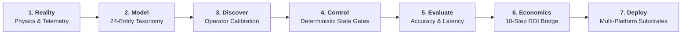

# FDE Workbench
### Production patterns for deploying AI into messy operational environments

[](.github/workflows/test.yml)
[](tests/)
[](#tamper-evident-audit-hash-chain-phase-15)
[](fde_workbench/evals/)
[](fde_workbench/telemetry/)
[](docs/tradecraft/)

> **Mission**: An executable forward-deployed engineering workbench for turning ambiguous operational problems into typed systems, deterministic controls, measurable economics, and deployable AI infrastructure.

---

## The FDE Deployment Loop



---

## 🏛️ Synthetic Deployment Cases

Two end-to-end synthetic customer deployments demonstrate the workbench in action across real Latin American trade corridors:

| Deployment Case | Operational Corridor | Economic Impact & Payback | Documentation & Architecture |
|---|---|:---:|---|
| [**Export Customs Reconciliation**](case-studies/customs-reconciliation/) | Ciudad del Este ➔ Foz do Iguaçu (BR-277) | **223.5% Net ROI**<br/>**1.7 mo payback** | [Overview](case-studies/customs-reconciliation/README.md) · [Discovery](case-studies/customs-reconciliation/discovery.md) · [Architecture](case-studies/customs-reconciliation/architecture.md) · [Economics](case-studies/customs-reconciliation/economics.md) · [Brief](case-studies/customs-reconciliation/deployment-brief.md) |
| [**Hidrovía Fluvial Convoy Allocation**](case-studies/fluvial-convoy/) | Paraguay River km 1590 (Villeta ➔ Nueva Palmira) | **620.4% Net ROI**<br/>**0.8 mo payback** | [Overview](case-studies/fluvial-convoy/README.md) · [Discovery](case-studies/fluvial-convoy/discovery.md) · [Architecture](case-studies/fluvial-convoy/architecture.md) · [Economics](case-studies/fluvial-convoy/economics.md) · [Brief](case-studies/fluvial-convoy/deployment-brief.md) |

---

## 🛠️ Field Tradecraft Modules

Supporting technical documentation detailing the engineering patterns implemented in the codebase:

| Tradecraft Guide | Core Engineering Question | Key Field Artifacts |
|---|---|---|
| [**01. Physical Reality & Domain Ontologies**](docs/tradecraft/01-domain-ontologies.md) | *How do we model physical constraints (river draft, axle weight) over lagging paperwork?* | 24-Entity Taxonomy, Provenance Enums, Critical Path |
| [**02. Discovery Intake & Operator Calibration**](docs/tradecraft/02-operator-discovery.md) | *How do we extract ground truth from operators without confirmation bias?* | `DiscoveryIntake` Schema, Assumption-Stripped Briefs, 4D Matrix |
| [**03. Deterministic Control & Governance**](docs/tradecraft/03-deterministic-control.md) | *Why must agent-reported completion be non-authoritative?* | 5-Stage Decision Pipeline, SHA-256 Audit Chain, Escalations |
| [**04. The Economic Bridge & ROI Equations**](docs/tradecraft/04-economic-bridges.md) | *How do we translate operational cycle time and exceptions into auditable EBITDA?* | 10-Step Economic Model, 12-Section Briefs, Payback Months |
| [**05. Multi-Platform Enterprise Substrates**](docs/tradecraft/05-platform-adapters.md) | *How do we deploy to Azure, Gemini, OpenAI, or Databricks without rewriting logic?* | Google Vertex AI, Azure AI Foundry, OpenAI, Databricks Mosaic |

---

## Scope & Non-Goals

- **NOT a SaaS product**: No billing layer, multi-tenancy, or commercial subscriptions.
- **NOT an autonomous agent**: No unsupervised execution or black-box agents.
- **NOT a production customer system**: Does not connect to live customer databases, send emails, or execute unauthorized external actions.
- **The FDE Reasoning & Control Plane**: Establishes a deterministic operational model grounded in empirical evidence and physical reality (fluvial draft restrictions, Mercosur cross-border customs DNA, Maquila regimes, and cash conversion cycles).
- **Core Architecture Doctrine**:
  $$\text{FDE Control Plane} \longrightarrow \text{Platform Adapter} \longrightarrow \text{Customer Environment}$$
  The core moat is Paraguay operational knowledge $\times$ discovery methodology $\times$ ontology $\times$ evidence $\times$ decision modeling $\times$ deployment capability. Gemini, Azure, OpenAI, and Databricks are execution substrates tailored to client environments ("Same operational model, different deployment adapter").

---

## Quickstart

The workbench is local-first, requires only Python 3.11 with `pydantic` and `fastapi`, and runs with zero external network dependencies.

```powershell
# 1. Install minimal dependencies
pip install -r requirements.txt

# 2. Launch the Workbench Web Interface
python run_workbench.py

# Alternatively via the package entrypoint:
python -m fde_workbench serve --port 8000
```

Open your browser at:
- **Workbench UI**: [http://127.0.0.1:8000](http://127.0.0.1:8000)
- **Interactive REST API Docs**: [http://127.0.0.1:8000/docs](http://127.0.0.1:8000/docs)

To run the automated test suite (72 unit tests):
```powershell
python -m unittest discover -s tests -p "test_*.py" -v
```

---

## Architecture & Layers (Phase 2 Reasoning Plane)

```
┌─────────────────────────────────────────────────────────────────────────────┐
│                       FDE WORKBENCH WEB INTERFACE (12 Panes)                │
│  [1. Discovery] [2. Evidence] [3. Ontology] [4. Entities] [5. Relationships]│
│  [6. Events] [7. Decisions] [8. Workflows] [9. AI Opportunities]            │
│  [10. Agent Specs & Gemini] [11. KPIs] [12. Synthetic Company]              │
└──────────────────────────────────────┬──────────────────────────────────────┘
                                       │ HTTP / REST API (FastAPI)
┌──────────────────────────────────────▼──────────────────────────────────────┐
│            LOCAL-FIRST SQLITE GRAPH & CRYPTOGRAPHIC AUDIT STORE             │
│  - Embedded SQLite Persistence (workbench.db in WAL mode)                   │
│  - Source Evidence Table (with indexed source types and provenance enums)   │
│  - Bi-directional Adjacency Indexing (Incoming/Outgoing 1-hop Traversal)    │
│  - Tamper-Evident SHA-256 Cryptographic Hash-Chained Audit Trail            │
│  - JSON Snapshot Persistence & Evidence Hydration (Import / Export / Reseed)│
└──────────────────────────────────────┬──────────────────────────────────────┘
                                       │ Validates & Hydrates
┌──────────────────────────────────────▼──────────────────────────────────────┐
│                  TYPED DOMAIN & ONTOLOGY LAYER (Pydantic v2)                 │
│  - Provenance Model (SYNTHETIC, CUSTOMER_OBSERVED, PUBLIC_SOURCE, etc.)    │
│  - Source Evidence Layer (EvidenceRecord linked to events and decisions)    │
│  - Discovery Intake Engine (Translates questionnaire into domain models)    │
│  - 24 Core Domain Entities (Organization, Facility, Shipment, Batch...)     │
│  - Explicit Typed Relationship Triples (operates, transports, settles...)   │
│  - Operational Event Model (Expected vs Observed state diffs & financial)   │
│  - 5-Stage Decision Pipeline (Observation -> Context -> Decision -> Action)│
│  - 4D FDE Prioritization (Economic Leverage, Ops, Feasibility, Strategy)   │
│  - Gemini Enterprise Substrate + Runnable google-genai Python SDK Scaffolding│
└──────────────────────────────────────┬──────────────────────────────────────┘
                                       │ Grounded Reference
┌──────────────────────────────────────▼──────────────────────────────────────┐
│          REFERENCE DOSSIER: Agro-Industrial del Este S.A. (AIDESA)           │
│  - Explicit Provenance: SYNTHETIC (modeling real Paraguayan physical reality)│
│  - 250 Headcount across Operations, Quality, Logistics, Comex, & Finance    │
│  - 2 Facilities: Planta Villeta (River Port) & Planta Hernandarias (Maquila) │
│  - Trade Corridors: Brazil (CDE/Foz BR-277) & Argentina (Falcón & Hidrovía) │
│  - 80 Approved Suppliers, 25 International Customers, 5 Empirical Evidences │
└─────────────────────────────────────────────────────────────────────────────┘
```

---

## Core Ontology: The 24 Domain Entities

1. **Organization**: Exporter entity (e.g. AIDESA S.A., RUC 80099412-4).
2. **Facility**: Industrial plants and ports (Planta Fluvial Villeta, Planta Maquila Hernandarias).
3. **Supplier**: 80 grain/feed producers, livestock farms, packaging, and barge lines.
4. **Customer**: 25 international buyers (Brazilian poultry feed integrators, Argentine crushers).
5. **Product**: High-protein soybean meal pellets 46.5%, crude degummed soy oil, chilled beef.
6. **Material**: Raw unprocessed soybeans, bulk yellow corn, 50kg polybags, flexitanks.
7. **Order**: Commercial export sales contracts with Incoterms (FOB Villeta, CIF Paranaguá, DPU Foz).
8. **PurchaseOrder**: Inbound commodity and packaging procurement commitments.
9. **Shipment**: 16-barge push convoys on the Hidrovía; double-trailer bitren trucks across CDE (Note: Barge convoys are instances of `Shipment` with `transport_mode="RIVER"`).
10. **Carrier**: Fluvial barge lines (Hidrovías del Sur) and terrestrial trucking fleets.
11. **Warehouse**: Silo batteries (60k MT at Villeta) and bonded fiscal depots (Hernandarias).
12. **Invoice**: Official export invoices (Factura de Exportación en USD, Timbrado DNIT).
13. **Payment**: International Swift MT103 wires, Mercosur SML payments, SIPAP transfers.
14. **Contract**: Master sales contracts, Incoterms 2020 definitions, and demurrage schedules.
15. **Document**: Bill of Lading (B/L), Carta de Porte Internacional (CRT), Romaneo, Packing List.
16. **CustomsDeclaration**: VUE (Ventanilla Única de Exportación), DUA, and MIC/DTA transit permits.
17. **RegulatoryObligation**: SENACSA animal health, SENAVE phytosanitary, Maquila CNIME, SEPRELAD.
18. **EmployeeRole**: Headcount distribution across 8 functional areas totaling exactly 250 roles.
19. **Machine**: Grain crushers (Bühler 120 TPH), expellers, weighbridges, barge loading spouts.
20. **ProductionBatch**: Industrial runs with recorded laboratory moisture/protein assays.
21. **QualityEvent**: High moisture (>14%), aflatoxin detection, broken container seals.
22. **OperationalEvent**: Fluvial river draft drops, customs border bridge delays, machine faults.
23. **Decision**: Managerial resolution evaluating trade-offs, recommendations, and authorized actions.
24. **KPI**: Cash Conversion Cycle, Border Dwell Time, Fluvial Draft Capacity, OTIF Delivery.

---

## Operational Event Model

An `OperationalEventRecord` captures physical reality rather than paperwork:
- `timestamp`: Event occurrence or detection time.
- `entity_id` & `entity_type`: Affected target entity.
- `event_type`: e.g. `river_draft_restriction`, `customs_document_missing`, `quality_failure`.
- `source`: Source of truth (`PREFECTURA_NAVAL_GAUGE`, `VUE_PORTAL`, `WEIGHBRIDGE_SCALE`, `TMS`).
- `severity`: `CRITICAL`, `HIGH`, `MEDIUM`, or `LOW`.
- `expected_state`: Baseline planned state (e.g. permissible draft 10.5 ft).
- `observed_state`: Real-world observation (e.g. permissible draft 8.4 ft at Paso Queso).
- `operational_impact`: Human/physical disruption description.
- `financial_impact`: Quantified loss/exposure in USD.
- `required_decision`: Nature of the decision demanded.
- `status`: `DETECTED`, `TRIAGED`, `DECISION_PENDING`, `MITIGATED`, `RESOLVED`.

---

## Decision Pipeline: Observation to Outcome

Enforces the core tradecraft sequence:
$$\text{OBSERVATION} \longrightarrow \text{CONTEXT} \longrightarrow \text{DECISION} \longrightarrow \text{AUTHORIZED ACTION} \longrightarrow \text{OUTCOME}$$

1. **Observation**: Triggered directly by an `OperationalEventRecord`.
2. **Context**: Relevant operational state, customer constraints, penalty clauses, and local alternatives.
3. **Decision & Options**: Multi-option trade-off matrix evaluating cost, latency, and risk, yielding a formal recommendation.
4. **Authorized Action**: Mandatory human authorization capturing who approved what, when, and with what parameters.
5. **Outcome**: Verified post-execution measurement checking actual latency, financial delta, and KPI impact.

### Decision Timeout & Escalation Engine (Phase 1.5 & Phase 3.6)
- **On-Demand & Scheduled Escalation Sweeps**: Escalation sweeps run on-demand (operator UI click or external cron trigger to `POST /api/decisions/check-escalations`). The workbench deliberately avoids unmonitored background daemon threads in local mode.
- Transitions decisions to `ESCALATED` status if unaddressed past a configurable SLA (`escalation_timeout_hours`).
- Escalation metadata captures `escalation_target_role`, `escalated_at`, and `escalation_reason`.
- Illustrated in synthetic scenario `evt-2026-005-escalation` $\rightarrow$ `dec-2026-005-escalated` where an unacknowledged customs hold at Puerto Falcón / Clorinda (Argentina) escalates from Customs Compliance to Executive leadership.

---

## Curated Critical Path Narrative (Phase 1.5)

To ground discussions without cognitive overload, the workbench defines and highlights the core **6-step Critical Path**:
$$\text{Order} \longrightarrow \text{Shipment} \longrightarrow \text{CustomsDeclaration} \longrightarrow \text{OperationalEvent} \longrightarrow \text{Decision} \longrightarrow \text{Outcome}$$

- Displayed as the default operational spine in the **Ontology** and **Workflows** tabs.
- The UI includes an instant toggle between the **Curated Critical Path** and the **Full 24-Entity Taxonomy**.

---

## Tamper-Evident Audit Hash-Chain (Phase 1.5)

Every entity, event, decision, and configuration mutation appended to the SQLite audit log is cryptographically bound:
$$\text{entry\_hash} = \text{SHA256}(\text{prev\_hash} + \text{timestamp} + \text{action} + \text{entity\_type} + \text{entity\_id} + \text{canonical\_json\_details})$$

- `verify_audit_chain()` walks every block and flags any insertion, deletion, or bit-flip.
- Exposed via `GET /api/audit/verify` and visible in the header badge of the web interface.

---

---

## Provenance Model & Physical Grounding (Phase 2)

Every fact, entity, event, evidence, and decision in the workbench carries an explicit data origin:
- `SYNTHETIC`: Deterministic test data generated to mirror real physical patterns (e.g. AIDESA reference dossier).
- `CUSTOMER_OBSERVED`: Directly measured or observed by an FDE on-site (e.g. weighbridge scale tickets, terminal inspections).
- `PUBLIC_SOURCE`: Verified official external sources (e.g. Prefectura Naval hydrometric water level bulletins, DNIT customs tariffs).
- `CUSTOMER_PROVIDED`: Unverified claims from customer interviews or self-reported questionnaires.
- `DERIVED`: Computed via deterministic inference, transformation engines, or simulation models.

---

## Source Evidence Layer (Phase 2)

Operational events and managerial decisions link backward to empirical evidence records:
$$\text{EvidenceRecord} \longrightarrow \text{OperationalEvent} \longrightarrow \text{DecisionRecord} \longrightarrow \text{Outcome}$$

- `EvidenceRecord`: Models empirical artifacts (`ERP_RECORD`, `TELEMETRY_STREAM`, `CUSTOMS_DOCUMENT`, `INTERVIEW_STATEMENT`, `PHYSICAL_INSPECTION`).
- Stores raw extracted claim text, confidence rating, source system, and graph references (`references_entities`, `references_events`, `references_decisions`).
- Stored in SQLite `evidence` table with indexed queries and full SHA-256 audit hash-chain logging.

---

## FDE Discovery Intake & Model Transformation (Phase 2)

When an FDE enters an enterprise, they capture operational reality through a structured intake dossier (`DiscoveryIntake`):
- Company Profile, Critical Workflows, Bottlenecks, Constraints, Systems of Record, and Key Decisions.
- Stored canonically in `aidesa_discovery_intake.json`.
- `DiscoveryTransformationEngine`: Programmatically compiles the intake into domain entities, relationships, workflows, and prioritized AI opportunities.
- CLI command: `python run_workbench.py discover --intake aidesa_discovery_intake.json`.

---

## Multi-Dimensional FDE Opportunity Prioritization (Phase 2)

Rather than an arbitrary "AI score", opportunities are evaluated across 4 distinct operational vectors (1-10 scale):
1. **Economic Leverage**: Annual payoff, cash-cycle impact, and margin sensitivity.
2. **Operational Characteristics**: Transaction volume, structured telemetry, error costs, and latency impact.
3. **Deployment Feasibility**: Integration friction, data readiness, HITL governance, and regulatory barriers.
4. **Strategic Value**: Client buy-in, corridor criticality, and pilot-to-expansion leverage.

- Identifies explicit **Candidates for FDE Pilot** (`candidate_for_pilot: true`) based on high leverage and actionable feasibility.

---

## Phase 3 — FDE Pilot Engine & Enterprise Deployment Blueprints

Phase 3 transforms the FDE Workbench into a client-facing delivery vehicle, bridging AI opportunities to concrete enterprise pilots.

### 1. Canonical `PilotSpecification`
Defines the exact parameters for an operational deployment on Monday morning:
- **Operational Reality**: Workflow, decision loop, trigger, document inputs, Paraguayan trade corridor context.
- **Accountability**: Explicit human `decision_owner` (e.g. Jefe de Comercio Exterior).
- **Human Authority Gates**: Inviolable human sign-off requirement, permitted drafting actions, and instant rollback conditions.
- **Measurable Acceptance Criteria**: Explicit performance targets (cycle time, exception rates, dwell hours) required for production sign-off.

### 2. Formal Mathematical `PilotEconomicModel`
Links physical operational friction directly to enterprise financial value through an auditable 10-step bridge:
$$\text{Baseline Annual Cost} = \text{Labor Cost} + \text{Exception Cost} + \text{Working Capital Drag}$$
$$\text{Target Annual Cost} = \text{Target Labor} + \text{Target Exception Cost}$$
$$\text{Addressable Savings} = \text{Baseline Total} - \text{Target Total}$$
$$\text{Pilot Batch Value} = \text{Volume in Pilot} \times \left(\frac{\text{Addressable Savings}}{\text{Annual Volume}}\right)$$
$$\text{Total 1st-Year Investment} = \text{Implementation Cost} + \text{Annual Software License}$$
$$\text{Net 1st-Year ROI (\$)} = \text{Addressable Savings} - \text{Total 1st-Year Investment}$$
$$\text{Net 1st-Year ROI (\%)} = \left(\frac{\text{Net 1st-Year ROI (\$)}}{\text{Total 1st-Year Investment}}\right) \times 100$$
$$\text{Payback Period (months)} = \left(\frac{\text{Implementation Cost}}{\text{Addressable Savings} / 12}\right)$$

### 3. 1-Click Client-Ready 12-Section FDE Deployment Brief Generator
Produces an executive briefing document (`FDEBriefGenerator`) in Markdown and structured JSON, adhering to the 12-section standard:
1. Operational Problem
2. Empirical Evidence
3. Decision Loop
4. Economic Impact & ROI Equation
5. Proposed AI Intervention
6. Human Authority & Governance
7. Required Data & Telemetry
8. Architecture & Integration Pattern
9. Pilot Scope & Duration
10. Success & Acceptance Criteria
11. Enterprise Platform Options
12. Expansion Path & Flywheel Leverage

### 4. Multi-Platform Deployment Proof
Proves the architectural doctrine: **Same operational model, different deployment adapter**.
- **Google Cloud / Gemini Enterprise**: Vertex AI Agent Engine (`gemini-2.5-flash` / `pro`) + OpenAPI function tools.
- **Microsoft Azure AI Foundry**: Azure OpenAI Service (GPT-4o) + Semantic Kernel plugins with `RequiresConsent` filters.
- **OpenAI Enterprise**: Assistants API v2 with strict JSON Schema function calling.
- **Databricks Mosaic AI**: Mosaic AI Agent Framework + MLflow pyfunc on Databricks Lakehouse with Unity Catalog functions.

### 5. Flagship Production Pilots Instantiated
- **`pilot-2026-customs-recon`**: Automated Export Customs Clearance & Tariff Reconciliation Pilot.
  - *223.5% Net 1st-Year ROI ($73,750 net value, 1.7 month payback)*
- **`pilot-2026-fluvial-draft`**: Hidrovía Dynamic Convoy Draft & Loading Allocation Pilot.
  - *620.4% Net 1st-Year ROI ($285,400 net value, 0.8 month payback)*

---

## Synthetic Reference Exporter: Agro-Industrial del Este S.A. (AIDESA)

- **Provenance**: Explicitly marked `ProvenanceType.SYNTHETIC` representing real physical Paraguayan trade corridors.
- **Headcount**: Exactly **250 employees** distributed across 8 functional roles.
- **Facilities**:
  1. *Planta Fluvial Villeta*: km 1590 on Paraguay River, 2,800 TPD crushing mill, barge dock, 60k MT silos.
  2. *Planta Maquila Hernandarias*: Alto Paraná near Friendship Bridge to Brazil, packaging under Ley 1064/97.
- **Corridors**:
  - *Brazil*: Terrestrial bitren highway PY-02 / BR-277 to Cascavel, Curitiba, and Port of Paranaguá.
  - *Argentina*: Fluvial barge push-convoys down Hidrovía to Rosario/San Lorenzo, and road freight via Falcón.
- **Network**: Exactly **80 suppliers** and **25 international customers**.
- **IT Systems**: SAP Business One, Google Workspace, Trans-Chaco TMS, Spreadsheets.

---

## 13-View Inspection Interface

1. **FDE Discovery**: Intake dossier browser and one-click model transformation compiler.
2. **Source Evidence**: Empirical telemetry & document registry with provenance and confidence badges.
3. **Ontology**: Schema browser, 24 entity definitions with Paraguayan context, and relationship rules.
4. **Entities**: Searchable, filterable directory with side-drawer attribute and graph inspector.
5. **Relationships**: Directed edge browser with source, relation, and target links.
6. **Operational Events**: Feed of real-world disruptions comparing expected baseline vs observed reality, with evidence links.
7. **Decisions**: 5-stage pipeline inspector (`Observation ➔ Context ➔ Decision ➔ Action ➔ Outcome`) with evidence citations.
8. **Workflows**: Lifecycle trace chains for fluvial and terrestrial export corridors.
9. **AI Opportunities**: 4D prioritization breakdown bars and `★ CANDIDATE FOR FDE PILOT` designations.
10. **Agent Specifications & Gemini**: Platform-agnostic blueprints with live compiler and Python SDK code generator.
11. **FDE Pilot Engine**: Production pilot blueprints with financial ROI gauges, 12-section brief drawer, economic bridge inspector, and live platform switcher.
12. **KPIs**: Metrics telemetry (Cash Conversion Cycle, Customs Dwell Time, Fluvial Draft Capacity, OTIF).
13. **Synthetic Company**: Enterprise dossier, 250-headcount distribution, IT landscape, and reset controls.

---

## CLI Reference

```powershell
# Start workbench web interface
python -m fde_workbench serve --host 127.0.0.1 --port 8000

# Ingest FDE discovery intake and compile operational model
python -m fde_workbench discover --intake aidesa_discovery_intake.json

# Generate synthetic dataset and verify counts
python -m fde_workbench seed --export aidesa_snapshot.json

# Verify cryptographic SHA-256 audit log hash-chain
python -m fde_workbench verify-audit

# Execute AI evaluation benchmark & safety gates (50 cases)
python run_workbench.py eval

# Inspect live observability & telemetry metrics (p50, p95 latency, tokens, cost)
python run_workbench.py telemetry

# List registered FDE pilots
python run_workbench.py pilot list

# Generate client-ready 12-section FDE deployment brief
python run_workbench.py pilot brief pilot-2026-customs-recon [--export brief.md]

# Calculate auditable operational economic bridge
python run_workbench.py pilot economics pilot-2026-customs-recon

# Generate multi-platform deployment plan (Gemini, Azure, OpenAI, Databricks)
python run_workbench.py pilot deploy-plan pilot-2026-customs-recon --platform microsoft_azure_ai_foundry

# Export snapshot
python -m fde_workbench export my_snapshot.json

# Import snapshot
python -m fde_workbench import my_snapshot.json
```
