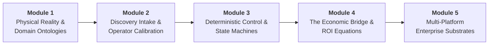

# Forward Deployed Engineering (FDE) — Curriculum & Tradecraft Codex

> **The Living Codex of Forward Deployed Engineering**: A 5-module applied tradecraft sequence bridging physical operations, typed domain ontologies, human calibration, deterministic control planes, and enterprise platform substrates.

---

## Curriculum Syllabus & Modules

| Module | Core Question | Key Artifacts | Lab / Code |
|---|---|---|---|
| [**01. Physical Reality & Domain Ontologies**](01-domain-ontologies.md) | *How do we model real-world physical friction instead of paperwork?* | 24-Entity Taxonomy, Provenance Enums, Critical Path | `tests/test_ontology.py` |
| [**02. Discovery Intake & Operator Calibration**](02-operator-discovery.md) | *How do we extract ground truth from operators without confirmation bias?* | Intake Dossier, Operator Interview Kit, 4D Prioritization | `python -m fde_workbench discover` |
| [**03. Deterministic Control & Governance**](03-deterministic-control.md) | *Why must agent completion be non-authoritative?* | 5-Stage Decision Pipeline, SHA-256 Audit Chain, Escalations | `python -m fde_workbench verify-audit` |
| [**04. The Economic Bridge & ROI Equations**](04-economic-bridges.md) | *How do we translate operational friction into an auditable financial equation?* | 10-Step Economic Model, 12-Section Briefs, Payback Period | `python run_workbench.py pilot economics` |
| [**05. Multi-Platform Enterprise Substrates**](05-platform-adapters.md) | *How do we deploy to Azure, Gemini, OpenAI, or Databricks without rewriting logic?* | Google Vertex AI, Azure AI Foundry, OpenAI, Databricks Mosaic | `tests/test_adapters.py` |

---

## Sample Client Deliverables & Proof Points

* [Automated Export Customs Clearance Brief (12 Sections)](../briefs/pilot-2026-customs-recon-brief.md) — *223.5% Net ROI, 1.7 mo Payback*
* [Hidrovía Dynamic Convoy Draft Allocation Brief (12 Sections)](../briefs/pilot-2026-fluvial-draft-brief.md) — *620.4% Net ROI, 0.8 mo Payback*
* [Customs Broker Calibration Script (Assumption-Stripped)](../briefs/calibration-customs.md)
* [Fluvial Fleet Captain Calibration Script (Assumption-Stripped)](../briefs/calibration-fluvial.md)
