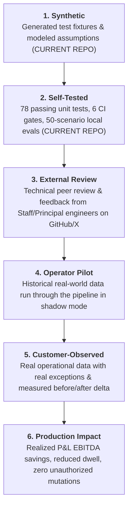
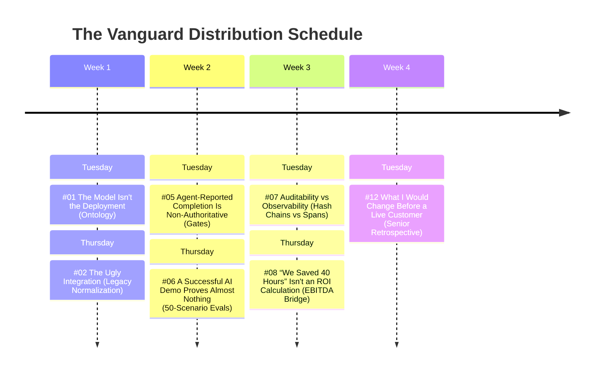
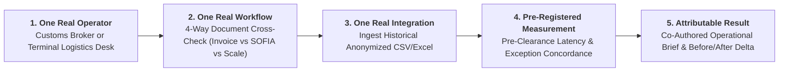

# The FDE External Validation & Distribution Playbook
### From Synthetic Tradecraft to Customer-Observed Production Impact

> **Locked Headline**: **Forward Deployed Engineer | Applied AI · Enterprise Integration · Operational Systems**  
> **One-Line Thesis**: *"I build the connective tissue between AI systems and operational reality."*  
> **Signature Doctrine**: *"The model is only one component. The deployment is the system surrounding it."*

---

## 1. The Evidence Hierarchy & Provenance Ladder

The greatest danger to an ambitious engineering showcase is getting stuck in the synthetic tier or conflating synthetic exercises with customer impact. 

Synthetic cases and local test harnesses prove engineering craftsmanship and domain literacy, but they do not prove customer impact.



### The Strict 3-Tier Provenance Safeguard
To maintain unimpeachable credibility in hiring loops and executive reviews, maintain strict, visible separation across three data provenance levels:

```text
SYNTHETIC
    Repository fixtures / modeled reference cases / local deterministic benchmarks.
    Status: Fully implemented in open-source repository.

CUSTOMER_PROVIDED
    Data supplied directly by an operator (e.g., historical CSV export provided by a broker).
    Status: Promoted only upon receiving an anonymized external dataset.

CUSTOMER_OBSERVED
    Behavior, telemetry, and exceptions actually observed live in the operator's physical environment.
    Status: Promoted only upon completing a desk shadowing or live pilot run.
```

> **The Safeguard Rule**: Only promote an artifact from one level to the next when you possess verifiable empirical proof. Never claim customer-observed reality on customer-provided or synthetic data.

---

## 2. The Locked Positioning & Meta-Narrative

### The Ultimate Public Narrative
When speaking to recruiters, engineering directors, or clients, the overarching narrative is not:
> *“I built an impressive FDE workbench repository.”*

The authoritative narrative is:

$$\begin{aligned}
\text{“I built a synthetic deployment environment to develop my FDE tradecraft.} \\
\text{Then I took the same evidence/decision/action architecture into a real operational workflow,} \\
\text{established an empirical baseline before intervention, and measured what changed.”}
\end{aligned}$$

The open-source repository serves as the **instrumentation and methodology**, while the operator experiment provides the **external validity**.

### The Recruiter Mental Model
When a Staff Recruiter or Hiring Manager at Google, Anthropic, or Palantir inspects your profile, they must conclude:
> *“This engineer already reasons natively about the problems our embedded FDEs face daily.”*

They must **never** think:
* *“This candidate built a portfolio specifically to get hired by Google.”*
* *“This is another generic wrapper around an LLM chat API.”*

### The Voice: Systems Detachment & Empirical Precision
1. **Professional Detachment**: Treat software as physical telemetry. Avoid hype, buzzwords ("autonomous revolution", "10x"), and self-congratulation.
2. **Empirical Precision**: Replace vague claims (*“We saved a huge amount of time”*) with exact distributions (*“Manual review averaged 42.0 minutes across 100 dispatches; automated 4-way cross-checks completed in 18ms with a 0.0% false-positive rate on syntax parsing”*).
3. **Explicit Seams**: Openly document missing enterprise IAM, legacy boundary translation, and concurrency limits (as in Field Note #12). Admitting where software ends and operational friction begins creates instant technical credibility.

---

## 3. The Vanguard Distribution Campaign (The Core 7)

Rather than dumping 12 posts chronologically, deploy **The Vanguard Seven** over 3.5 weeks (Tuesday/Thursday cadence). These seven posts cut directly to your core differentiation.



### The Vanguard Seven Breakdown

| Order | Field Note | Strategic Objective in Recruiter Funnel | Direct Code Anchor |
|---|---|---|---|
| **1** | [**#01 — The Model Isn't the Deployment**](docs/field-notes/01-the-model-isnt-the-deployment.md) | Hook: Shifts attention from LLM weights to physical supply chain constraints and domain modeling. | [`fde_workbench/domain/ontology.py`](fde_workbench/domain/ontology.py) |
| **2** | [**#02 — The Ugly Integration**](docs/field-notes/02-the-ugly-integration.md) | Technical Proof: Demonstrates willingness to build unglamorous plumbing (dirty Latin CSVs, regex normalization). | [`fde_workbench/integrations/legacy_connector.py`](fde_workbench/integrations/legacy_connector.py) |
| **3** | [**#05 — Agent-Reported Completion Is Non-Authoritative**](docs/field-notes/05-agent-reported-completion.md) | Architecture Thesis: Shows why models cannot mutate state directly; introduces deterministic authority gating. | [`fde_workbench/domain/decisions.py`](fde_workbench/domain/decisions.py) |
| **4** | [**#06 — A Successful AI Demo Proves Almost Nothing**](docs/field-notes/06-a-successful-ai-demo-proves-almost-nothing.md) | Safety Rigor: Replaces vibe checks with 50 operational scenarios and `unauthorized_actions == 0`. | [`fde_workbench/evals/harness.py`](fde_workbench/evals/harness.py) |
| **5** | [**#07 — Auditability and Observability Are Different**](docs/field-notes/07-auditability-and-observability-are-different.md) | Systems Maturity: Decouples cryptographic compliance ledgers from runtime latency/cost spans. | [`fde_workbench/telemetry/tracer.py`](fde_workbench/telemetry/tracer.py) |
| **6** | [**#08 — “We Saved 40 Hours” Isn't an ROI Calculation**](docs/field-notes/08-we-saved-40-hours-isnt-an-roi-calculation.md) | Executive Literacy: Translates cycle-time reduction into an auditable 10-step EBITDA bridge. | [`case-studies/customs-reconciliation/economics.md`](case-studies/customs-reconciliation/economics.md) |
| **7** | [**#12 — What I Would Change Before a Live Customer**](docs/field-notes/12-what-i-would-change-before-a-live-customer.md) | Senior Engineering Judgment: A candid audit of missing IAM, OT firewalls, and SQLite concurrency. | Architecture Retrospective |

### The Technical Reservoir (The 5 Follow-ups)
Keep these 5 posts in reserve for mid-thread replies, follow-up deep-dives, or inbound recruiter inquiries:
* **#03 (Provenance as a Primitive)**: Drop when someone asks about data validation or hallucination mitigation.
* **#04 (Discovery Before Software)**: Drop when discussing stakeholder alignment or client intake.
* **#09 (Multi-Platform Adapters)**: Drop when discussing Vertex AI vs. Azure OpenAI vs. Databricks portability.
* **#10 & #11 (Customs & River Case Studies)**: Drop as deep-dive companion whitepapers.

---

## 4. The "1-1-1-1-1" Operator Validation Protocol

The operator engagement must be structured as an **evidence-generation experiment**, never as a disguised sales pitch. 

$$\mathbf{1\text{ Real Operator}} \longrightarrow \mathbf{1\text{ Real Workflow}} \longrightarrow \mathbf{1\text{ Real Integration}} \longrightarrow \mathbf{1\text{ Measurable Delta}} \longrightarrow \mathbf{1\text{ Attributable Result}}$$



### The Rule: Pre-Register the Measurement Protocol
**Do not promise the operator a particular outcome** (e.g., never say: *"We will find tariff errors and save you \$50,000"*). Promising results beforehand turns the experiment into a confirmation-bias trap.

Instead, agree on the measurement protocol **before inspecting a single row of data**:

#### 1. Baseline (Pre-Intervention)
* **Current Workflow**: How are cross-border dispatches currently verified?
* **Volume**: Number of historical records in the sample batch (e.g., 50–100 dispatches).
* **Manual Processing Time**: Time spent per dispatch by human clerks (e.g., 35–45 minutes).
* **Existing Error/Rework Rate**: Historical rate of red-channel border flags or customs administrative adjustments.
* **Operational Consequence**: Financial cost of border dwell (e.g., carrier demurrage / driver waiting fees).

#### 2. Intervention (The System Boundaries)
* **Input Data**: Exact schemas entering the pipeline (e.g., SOFIA export CSV + SAP invoice PDF export + Weighbridge báscula text log).
* **Transformation**: Deterministic parsing of Latin formats (`DD/MM/YYYY`, comma decimals, plate extraction).
* **Permitted Decisions**: What the system is permitted to evaluate (e.g., 4-way consistency: weights, plate numbers, tariff codes).
* **Human Authority**: The system drafts a pre-clearance report; zero external actions occur without the licensed customs broker's digital sign-off.

#### 3. Measurement (The Objective Delta)
* **Processing Latency**: Wall-clock time to reconcile the batch (manual vs. automated).
* **Detection Concordance**: Agreement between manual human review and automated cross-check.
* **False-Positive Rate**: Legitimate dispatches incorrectly flagged by the system.
* **False-Negative Rate**: Discrepancies missed by the system that human inspection caught.
* **Operator Override Rate**: How often the human broker disagrees with the system's advisory recommendation.
* **Economic Consequence**: Modeled demurrage or administrative rework avoided.

#### 4. Evidence (The Attributable Artifact)
* Anonymized input fixture (`CUSTOMER_PROVIDED`).
* Execution telemetry trace (`fde_workbench/telemetry/tracer.py`).
* Cryptographic decision record (`fde_workbench/domain/audit.py`).
* Operator verification sign-off.
* Before/After comparative delta table.

---

### Step-by-Step Operator Engagement Plan

### Pre-Execution Operational Adjustments

| Step | Status | Operational Discipline & Caveats |
|---|---|---|
| **1. GitHub** | **Execute** | Clean working tree; push `main` branch to GitHub. |
| **2. Field Note #01** | **Execute (Calibrated)** | Label the Bill of Lading and weighbridge scenarios explicitly as *illustrative failure modes*. An operator will immediately spot invented specifics if framed as historical fact. |
| **3. Operator Targets** | **Use as Hypotheses** | The target operational bottlenecks are hypotheses, not diagnoses. Phrase outreach as a question (*"How do you handle X today?"*), not a sales diagnosis. |
| **4. Measurement Protocol** | **Pre-Register & Date-Lock** | Agree on metrics beforehand and record the date sent. **Zero metric tuning after seeing the data.** |
| **5. Anonymization** | **Question-Driven Minimization** | Treat scripts as convenience utilities, not cryptographic panaceas. Use salted HMAC for low-entropy IDs (RUC, C.I.), exact column matching (avoiding substring bugs like `"ci"` in `precio`), and configurable bucketing rather than blind zeroing. |

---

### Step-by-Step Operator Engagement Plan

#### Step 1: Identify the Local Partner (Hypotheses)
In Asunción / Central Paraguay, target operational leads with an inquiry mindset:
1. **Customs Brokerage Firm (*Agencia de Despacho Aduanero*)**: Handling grain, meat, or maquila dispatches via SOFIA.
2. **Grain Logistics Desk**: Regional exporter dispatching trucks along the BR-277 corridor (Ciudad del Este to Paranaguá).
3. **Fluvial Port Terminal Desk**: Operational desk at Puerto Caacupemí, Puerto Terport Villeta, or Puerto Seguro Fluvial.

#### Step 2: The Inquiry Outreach Script (Question-Led)
Reach out with open operational inquiry rather than a presumptuous diagnosis:

> *"Estimado [Nombre],*
> 
> *Estoy investigando la integración técnica de sistemas de comercio exterior en el corredor Paraguay-Brasil y he desarrollado un entorno de pruebas de código abierto enfocado en la validación previa al despacho.*
> 
> *Me interesa conocer su perspectiva operativa: **¿Cómo gestionan hoy la reconciliación entre la báscula de terminal, la factura y el despacho en SOFIA para evitar demoras en frontera? ¿Es realmente un cuello de botella en su día a día, o la fricción principal está en otra parte del proceso?** *
> 
> *Estamos realizando mediciones técnicas con un protocolo pre-registrado sobre lotes históricos anonimizados para comparar tiempos de revisión manual y concordancia de datos, sin fines comerciales ni venta de software.*
> 
> *¿Tendría 15 minutos esta semana para una breve conversación técnica?"*

#### Step 3: Question-Driven Data Minimization Script (Hardened HMAC)
Do not present this as a security guarantee. The operator must decide what data leaves their environment based on the specific measurement question.

This script solves the four critical failure modes of naive masking:
1. **HMAC-SHA256 with Local Salt**: Generates a 32-byte secret salt that **never leaves the operator's machine**, defeating rainbow-table attacks against low-entropy RUCs and C.I. numbers.
2. **Exact Column Mapping**: Prevents over-matching bugs (e.g. substring `"ci"` matching `precio`, or `"gs"` matching `cargas`).
3. **Preserves Economic Analysis**: Allows range-bucketing for financial/volume columns instead of blindly deleting the outcome variables.
4. **Configurable Linkability**: Allows the operator to choose between linkable pseudonyms (HMAC), range bucketing (BUCKET), or complete redaction (REDACT).

```python
"""
anonymize_batch.py — Question-Driven Data Minimization Utility
Usage: python anonymize_batch.py input.csv output_clean.csv
"""
import csv
import hmac
import hashlib
import os
import secrets
import sys

# Generate or load an operator-local secret salt that NEVER leaves this machine
SALT_FILE = ".operator_secret.salt"
if not os.path.exists(SALT_FILE):
    with open(SALT_FILE, "wb") as f:
        f.write(secrets.token_bytes(32))

with open(SALT_FILE, "rb") as f:
    OPERATOR_SALT = f.read()

def hmac_pseudonym(value: str) -> str:
    """Cryptographically salted pseudonym preserving linkability without rainbow-table exposure."""
    if not value or not value.strip():
        return ""
    digest = hmac.new(OPERATOR_SALT, value.strip().encode("utf-8"), hashlib.sha256).hexdigest()
    return f"ID_{digest[:12]}"

def bucket_numeric(value: str, bucket_size: float = 10000.0) -> str:
    """Buckets commercial values into ranges to preserve economic signal without exposing exact terms."""
    try:
        clean_val = value.replace(".", "").replace(",", ".")
        num = float(clean_val)
        low = int(num // bucket_size) * int(bucket_size)
        high = low + int(bucket_size)
        return f"{low:d}-{high:d}"
    except (ValueError, TypeError):
        return "[REDACTED_NUM]"

# EXACT column configuration (configured with the operator per schema)
COLUMN_POLICIES = {
    # Linkable Identifiers (HMAC salted)
    "ruc_exportador": ("HMAC", hmac_pseudonym),
    "ruc_transportista": ("HMAC", hmac_pseudonym),
    "chofer_cedula": ("HMAC", hmac_pseudonym),
    "matricula_camion": ("HMAC", hmac_pseudonym),
    # Economic / Outcome Variables (Bucket to preserve demurrage/cost calculations)
    "valor_flete_usd": ("BUCKET", lambda v: bucket_numeric(v, 500.0)),
    "costo_demora_estimado": ("BUCKET", lambda v: bucket_numeric(v, 250.0)),
    # Full Redactions
    "nombre_chofer": ("REDACT", lambda _: "[REDACTED]"),
    "contacto": ("REDACT", lambda _: "[REDACTED]")
}

def process_file(in_path: str, out_path: str):
    with open(in_path, mode="r", encoding="utf-8-sig", errors="replace") as fin, \
         open(out_path, mode="w", encoding="utf-8", newline="") as fout:
        
        reader = csv.DictReader(fin, delimiter=";")
        writer = csv.DictWriter(fout, fieldnames=reader.fieldnames, delimiter=";")
        writer.writeheader()
        
        for row in reader:
            for col, (policy, transform) in COLUMN_POLICIES.items():
                if col in row:
                    row[col] = transform(row[col])
            writer.writerow(row)
            
    print(f"Data minimization complete -> {out_path}")
    print(f"Salt preserved locally in {SALT_FILE}. DO NOT SHARE THE SALT FILE.")

if __name__ == "__main__":
    if len(sys.argv) < 3:
        print("Usage: python anonymize_batch.py <input.csv> <output.csv>")
    else:
        process_file(sys.argv[1], sys.argv[2])
```

#### Step 4: The Golden Attributable Artifact
When completed, author a co-branded or anonymized engineering report:
> **"Field Validation Brief: Pre-Registered Reconciliation Measurement across 84 Historical Mercosur Dispatches"**  
> *Baseline Review Time: 38.2 min/dispatch ➔ Automated Gate: 22ms/dispatch.*  
> *False-Positive Rate: 1.2% (1 false alert on non-standard grain packaging).*  
> *Exceptions Detected: 2 scale weight discrepancies confirmed by human broker.*  
> *Provenance: Promoted to `CUSTOMER_OBSERVED`.*

---

## 5. The Falsifiable Observation Scoreboard

> **Core Doctrine**: Do not optimize for "first customer." Optimize for **"first falsifiable external observation."**  
> A real operator telling you *"your assumed workflow is wrong"* is already high-value empirical evidence. A measurable improvement is the second-order outcome.

| Stage | Success Condition | Verified Evidence Gate |
|---|---|---|
| **1. Distribution** | Relevant operator sees the work | Read receipt, direct message reply, or warm intro confirmed. |
| **2. Conversation** | Operator confirms the workflow is real | Operator validates: *"Yes, we struggle with Báscula vs. SOFIA dwell."* |
| **3. Access** | Anonymized historical data becomes available | Ingestion of 50–100 masked dispatch records (`CUSTOMER_PROVIDED`). |
| **4. Baseline** | Pre-intervention metrics are recorded | Manual cycle time, error rate, and demurrage penalties documented. |
| **5. Intervention** | System runs within predefined authority boundaries | Deterministic pipeline executes with 0 unverified mutations. |
| **6. Measurement** | Objective delta is captured | Processing latency, concordance, false-positive/negative rates logged. |
| **7. Validation** | Operator confirms or contests the interpretation | Operator review: *"Your finding on weight discrepancy #2 was correct."* |
| **8. Evidence** | Artifact independently traced to engagement | Promoted to `CUSTOMER_OBSERVED` in a co-authored or anonymized brief. |

> [!CAUTION]
> **The Development Invariant**: **Do not add another feature to `fde-workbench` unless one of these 8 stages exposes a real operational requirement.**

---

## 6. The Crown-Jewel Artifact: "What Broke When My Synthetic FDE System Met a Real Operator"

The climax of the external validation campaign is not a glossy marketing case study claiming 95% efficiency gains. The strongest demonstration of senior Forward Deployed Engineering is **empirical fidelity**:

> ### The Publication Anchor: Field Note #13
> **Title**: *"What Broke When My Synthetic FDE System Met a Real Operator"*  
> **Core Premise**: The synthetic workbench was a rigorous hypothesis. The operator's facility was physical reality. Here is what failed at the boundary, and how the architecture adapted.

### The Non-Spectacular Fidelity Principle
In technical hiring loops and enterprise customer reviews:
* A claim like: *"Our pipeline reduced reconciliation time by 32%"* is useful.
* But an empirical finding like:  
  > *"Our assumed workflow was flawed: we thought the broker's bottleneck was tariff classification, but 80% of their actual cycle time was spent resolving corrupted driver tax IDs from upstream Báscula weight tickets. We had to shift the integration boundary upstream to the scale terminal before the model was ever called."*  
  is **exponentially stronger FDE evidence**.

It proves you are not a "demo engineer" who forces reality to fit an AI wrapper. It proves you are an embedded engineer who respects operational truth above code hypotheses.

---

## 7. The Career Narrative Lock

When presenting this work to hiring committees or executive clients, deliver this exact synthesis:

$$\begin{aligned}
\mathbf{\text{“I didn’t build a portfolio pretending to be an FDE.}} \\
\mathbf{\text{I built a controlled deployment environment, froze my assumptions,}} \\
\mathbf{\text{took it into an operational environment, and let reality determine what I had to change.”}}
\end{aligned}$$

That transforms the repository from a *showcase project* into an **authoritative tradecraft laboratory and deployment methodology**.


